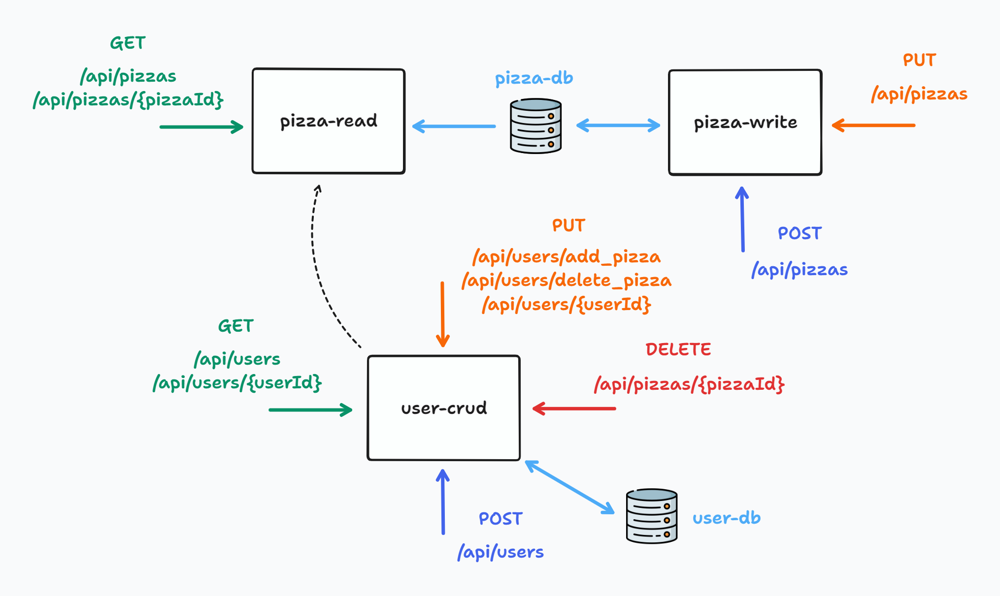
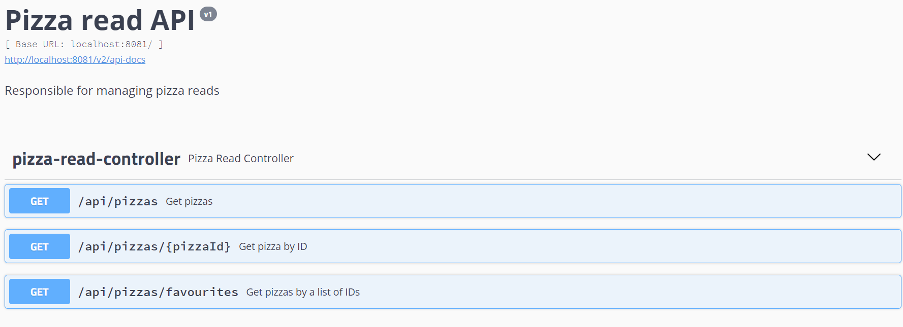
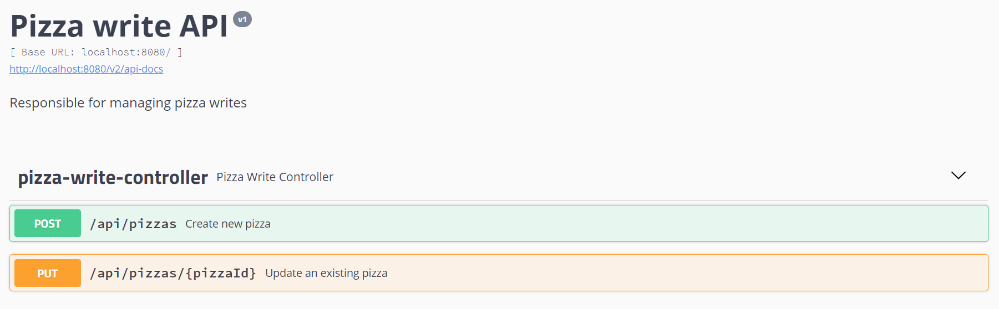
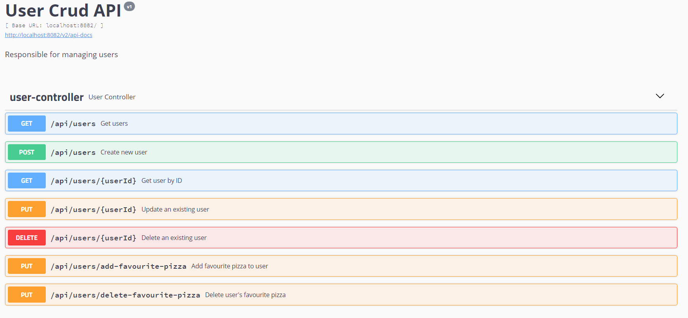

# Pizzeberus: Spring Cloud Project
## Microservices
### Pizza-read
- Responsible for managing pizza reads
### Pizza-write
- Responsible for managing pizza writings
### User-crud
- Responsible for managing users

## Installation
1. ``mvn clean install`` to install the project dependencies
2. ``docker-compose up --build`` to build up Rabbitmq, Zipkin & PostgreSQL
3. Start the Config Server
4. Start the Eureka Server
5. Start the Gateway Server
6. Start the microservices: pizza-read, pizza-write & user-crud

## Documentation
### Config Server
- Store the configurations for all microservices in the application
- Each microservice doesn't need to store its configuration

### Eureka server
- Service discovery for microservices
- Contains all the information about client microservices running on which IP address and port
- [Eureka URL](http://localhost:8761/)

### Gateway
- A simple, yet effective way to route to APIs
- Retrieve data from multiple services with a single request
- [Gateway URL](http://localhost:9000/)

### Zipkin
- Distributed tracing
- Provides mechanisms for sending, receiving, storing & visualizing traces
- [Zipkin URL](http://localhost:9411/)

### Pizza-read API
- Retrieve pizzas
- Retrieve pizza by ID
- Retreive pizzas by list of IDs
- [Swagger Pizza-read](http://localhost:8080/swagger-ui.html#/)

### Pizza-write API
- Create a new pizza
- Modify a pizza
- [Swagger Pizza-write](http://localhost:8081/swagger-ui.html)

### User-crud API
- Create a new user
- Modify a user
- Delete a user
- Retrieve users
- Retrieve user by ID
- Select pizzas as favourites of users
- Unselect pizzas as favourites of users
- [Swagger User-crud](http://localhost:8082/swagger-ui.html)

